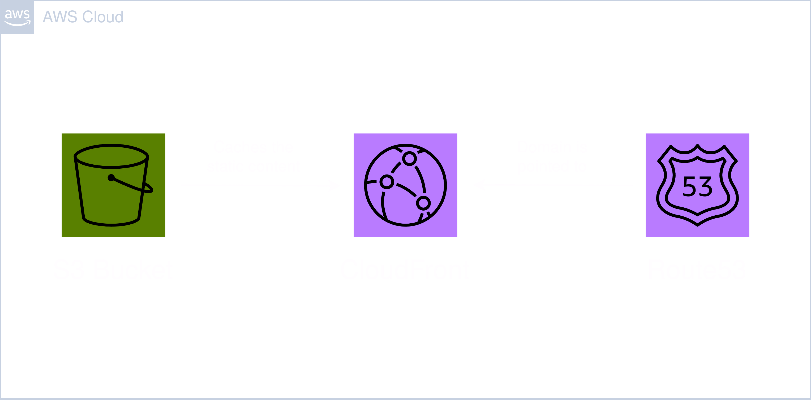

# Module: Website



This module provides a S3 bucket where static content for a website can be uploaded. The content will be cached in CloudFront's edge locations and the provided domain will be pointed to the CloudFront distribution with Route53. For the provided domain a public hosted zone must be present in the deploying account.

## Contents

- [Requirements](#requirements)
- [Inputs](#inputs)
- [Outputs](#outputs)
- [Example](#example)
- [Contributing](#contributing)

## Requirements

| Name      | Version  |
| --------- | -------- |
| terraform | >= 1.0   |
| aws       | >= 5.20  |
| random    | >= 3.6.0 |

## Inputs

| Name          | Description                                                                                                                                                                              | Type          | Default          | Required |
| ------------- | ---------------------------------------------------------------------------------------------------------------------------------------------------------------------------------------- | ------------- | ---------------- | :------: |
| identifier    | Unique identifier to differentiate global resources.                                                                                                                                     | `string`      | n/a              |   yes    |
| domain        | Custom domain pointed to the CloudFront distribution.                                                                                                                                    | `string`      | n/a              |   yes    |
| zone_id       | ID of the public hosted zone for the domain. (When not specified the public hosted zone of the domain will be pulled with a data resource from your account)                             | `string`      | ""               |    no    |
| price_class   | Price class for the CloudFront distribution. Valid values: 'PriceClass_All', 'PriceClass_200' or 'PriceClass_100'.                                                                       | `string`      | "PriceClass_All" |    no    |
| min_ttl       | Minimum amount of time (in seconds) that you want objects to stay in CloudFront caches before CloudFront queries the origin to see whether the object has been updated.                  | `number`      | 0                |    no    |
| default_ttl   | Default amount of time (in seconds) that an object is in a CloudFront cache before CloudFront forwards another request in the absence of an 'Cache-Control max-age' or 'Expires' header. | `number`      | 3600             |    no    |
| max_ttl       | Maximum amount of time (in seconds) that an object is in a CloudFront cache before CloudFront forwards another request to your origin to determine whether the object has been updated.  | `number`      | 86400            |    no    |
| ip_rate_limit | Rate limit for traffic from the same IP address over a time period of 5 minutes.                                                                                                         | `number`      | 0                |    no    |
| tags          | A map of tags to add to all resources.                                                                                                                                                   | `map(string)` | {}               |    no    |

## Outputs

| Name | Description              |
| ---- | ------------------------ |
| id   | The ID of the S3 bucket. |

## Example

```hcl
module "website" {
  source = "github.com/custom-terraform-aws-modules/website"

  identifier    = "example-website-dev"
  domain        = "example.com"
  price_class   = "PriceClass_100"
  min_ttl       = 0
  default_ttl   = 360
  max_ttl       = 86400
  ip_rate_limit = 100

  tags = {
    Project     = "example-project"
    Environment = "dev"
  }
}
```

## Contributing

In order for a seamless CI workflow copy the `pre-commit` git hook from `.github/hooks` into your local `.git/hooks`. The hook formats the terraform code automatically before each commit.

```bash
cp ./.github/hooks/pre-commit ./.git/hooks/pre-commit
```
